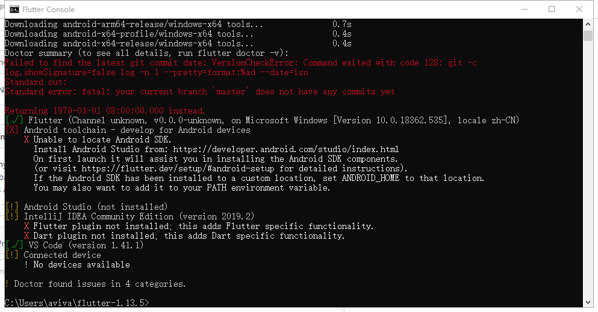

1，https://github.com/flutter/flutter/releases  
下载稳定zip，解压后需要git init,否则会报错   
```
Error: The Flutter directory is not a clone of the GitHub project.
       The flutter tool requires Git in order to operate properly;
       The to set up flutter, run the following command:
       git clone -b beta https://github.com/flutter/flutter.git
```
2，将
PUB_HOSTED_URL=https://pub.flutter-io.cn  
FLUTTER_STORAGE_BASE_URL=https://storage.flutter-io.cn  
Path=C:\Users\aviva\flutter-1.13.5\bin;
C:\Users\aviva\flutter-1.13.5\bin\cache\dart-sdk\bin
添加到环境变量  
3，运行flutter doctor后会下载所需sdk
4，在vscode里安装flutter插件  

5,flutter create <directory>创建项目

### android
6,https://www.androiddevtools.cn/#上下载android sdk tools,选择android-sdk-windows，
将安卓sdk添加到环境变量，ANDROID_HOME=C:\Users\aviva\android-sdk-windows;ANDROID_SDK_ROOT=C:\Users\aviva\android-sdk-windows
%ANDROID_HOME%\build-tools\29.0.2;%ANDROID_HOME%\tools;%ANDROID_HOME%\platform-tools添加到Path
7，在windows上运行高版本的模拟器会报错找不到kernel，低版本可行
别忘了在sdk manager的extras选项中安装haxm
https://github.com/intel/haxm/releases/tag/v7.5.4下载haxm安装包并安装

### web
flutter config --enable-web
run: flutter run -d chrome
build: flutter build web
在vscode里的热更新并不是保存一下就自动更新了，而是需要按一下字母r键
依赖项在dependencies里面，flutter packages get下载依赖

## 其他
flutter doctor报无法检查jdk manager的licenses，原因是jdk版本过高，降到1.8以下即可