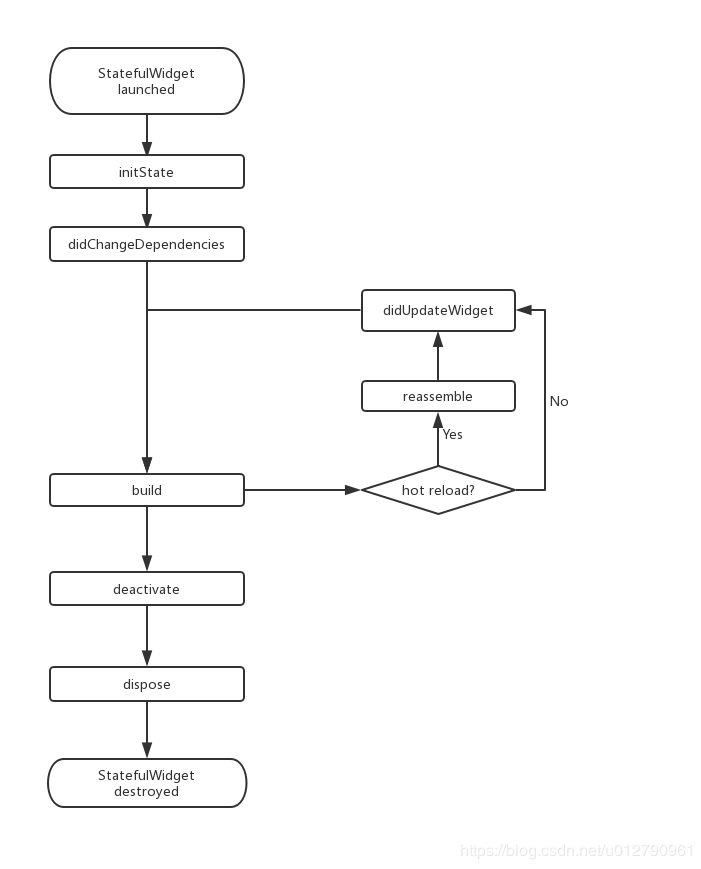

MaterialApp用于MaterialDesign，Scaffold用于布局结构的基本实现
@immutable 类或者子类不可变
stl as语法快捷键
stateless转成ststeful:alt+enter
将build出来的widget单独抽取:alt+enter+w

Stateless的成员变量都应该是final类型
Column不可滚动，ListView可滚动，SizedBox创建间距
alt+回车，可以选择wrap with container
前面加下划线表示私有

statefulWidget为什么build方法放在了state中？
1，build出的widget需要依赖state中的变量
2，在flutter的运行过程中，widget是不断销毁和创建的，当自己的状态发生改变时，并不希望重新创建一个新的state

state里面的this.widget指向相应的statefulWidget

flutter不可以用string+number，可以通过$符号在引号中使用数字
要想数据响应式改变，必须调用setState()函数，可以放里面也可以放前面

StatelessWidget构造函数被调用两次是as的bug
StatefulWiget的生命周期:  

initState()和dispose(),didChangeDependencies(),didUpdateWidget()中必须调用super
调用setState方法时会重新调用build,hotreload时也重新调用build

Text大小就是包裹的内容，Text.rich富文本

默认最大缓存一千张图片，一百兆

通过Text使用字体图标时，加\u使用unicode编码，同时要设置对应的字体

按钮设置宽高，包裹Container，再给Container设置宽高
double.infinity填充整个父容器
获取用户输入值，需绑定controller
compute接收的函数必须是全局的
默认值必须是常量