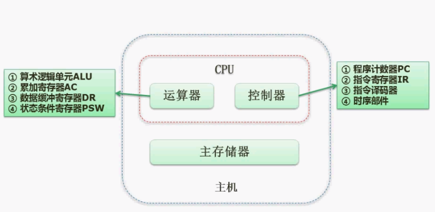
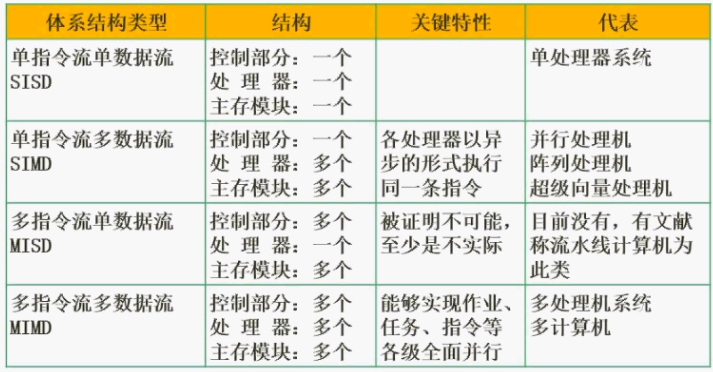
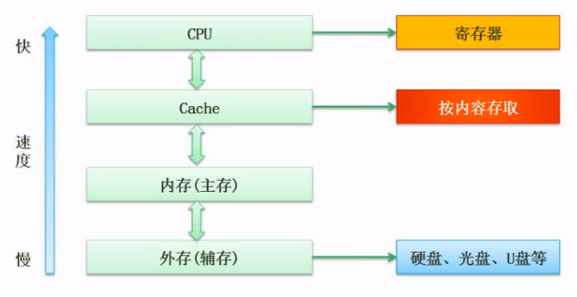
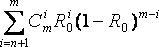
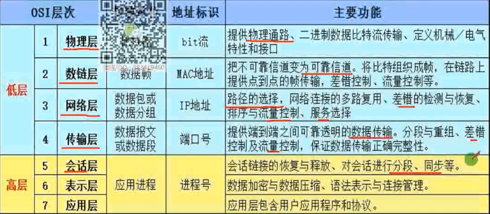

# 考试大纲
## 计算机内的数据表示、算术和逻辑运算方法
- R进制转十进制，按权展开；十进制转R进制，短除法，到0为止。
- 正数的反码和补码都与原码相同。  
负数的反码为对该数的原码除符号位外各位取反。  
负数的补码为对该数的原码除符号位外各位取反，然后在最后一位加1。  
移码是符号位取反的补码。    
原码 -(2n-1-1)~(2n-1-1)  
反码 -(2n-1-1)~(2n-1-1)  
补码 -2n-1~2n-1-1  
因为源码中有正0和负0，而补码0的表示唯一。
- 浮点数运算：对阶(以高次为准)，尾数计算，结果格式化(确保小数左边为1)  

## 掌握计算机体系机构以及各主要部件的性能和基本工作原理
### 计算机结构
- 
PSW:存储运算过程中的标识位  
PC:确定下一条指令的位置
- 关联存储器（相联存储器），是一种不根据地址而是根据存储内容来进行存取的存储器，可以实现快速地查找块表。既可以按照地址寻址也可以按照内容寻址（通常是某些字段），为了与传统寄存器作区别，称为按内容寻址的存储器。
- 随机存取存储器（英语：Random Access Memory，缩写：RAM），也叫主存，是与CPU直接交换数据的内部存储器。它可以随时读写（刷新时除外），而且速度很快，通常作为操作系统或其他正在运行中的程序的临时数据存储介质。RAM工作时可以随时从任何一个指定的地址写入（存入）或读出（取出）信息。
- 处理机主要由处理器、存储器和总线组成。总线包括数据总线、地址总线、控制总线。
### Flynn分类法

### CISC和RISC
CISC复杂指令集，数量多，变长，寻址方式多；RISC精简指令集，数量少，定长，增加通用寄存器，寻址方式少。
### 流水线技术
- TP吞吐率=指令总数÷执行这些指令所需要的总时间。极限吞吐率为1/dt。
- 流水线周期为执行时间最长的一段。理论公式：流水线执行总时间=(t1+t2+^+tk)+(n-1)即1条指令执行时间+(指令属-1)*流水线周期。
实践公式：把每一段都看作一个流水线周期时长，(k+n-1)*dt,k表示分几段。
- 流水线加速比S=不使用流水线执行时间/使用流水线的执行时间
- 流水线效率=n个任务占用的时空区/k个流水段总的时空区
### 存储系统
内存包括主存和高速缓存

- cache+主存储器系统的平均周期t3=h*t1+(1-h)*t2,t1表示cache的周期时间，t2表示主存的周期时间，h为命中率。
- 局部性原理：时间局部性被引用过一次的存储器位置在未来会被多次引用，空间局部性如果一个存储器的位置被引用，那么将来他附近的位置也会被引用。
- 主存，随机存取存储器(DRAM,SRAM),只读存储器(MROM,PROM,EPOM,闪速存储器)
- 地址计算：大地址-小地址+1，除以2的10次方等于左移十位
- 磁盘存取时间=寻道时间+等待时间（平均定位时间+转动延迟)
- 总线：内部总线：芯片与处理器之间的，系统总线（数据总线，地址总线，控制总线）：插线板层级，外部总线：和外部设备的

### 系统可靠性分析
- 串联可靠性：R=R1×R2×R3×……×Rn 
- 串联失效率: λ=λ1+λ2+λ3+……+λn 
- 并联可靠性：R=1-(1-R1)×(1-R2)×(1-R3)×……×(1-Rn) 
- 并联失效率：λ=1/((1/1*λ1)+(1/2*λ2)+(1/3*λ3)+...+(1/n*λn))
- n模冗余系统：在N个子系统中，只要有n+1个或n+1个以上的系统能正常工作，输出正确的结果。R= 
- 混合系统:串联+并联

### 差错控制
- 码距：一个编码系统中任意两个合法编码之间至少有多少个二进制位不同。
- 在一个码组内为了检测e个误码，最小码距d应该满足d>e+1,在一个码组内为了纠正t个误码，最小码距d应该满足d>2t+1
- 模2除法：在做除数运算的过程中不计其进位的除法。
- 循环校验码CRC：可以检错，不能纠错。CRC校验码位数k=生成多项式位数-1，被除数为生成多项式系数，进行模2除法的余数。
- 海明校验码：
2k-1>=n+k,n:元数据位，k校验位，海明校验码放在2的k次幂上，将数据为用二进制表示，每列数值为1的元素做异或运算。

## 掌握操作系统、程序设计语言的基础知识，了解编译程序的基本知识

## 熟练掌握常用数据结构和算法

## 熟悉数据库、网络和多媒体的基础知识

## 掌握C程序设计语言，以及C++\Java中的一种程序设计语言

## 熟悉软件工程，软件过程改进和软件开发项目管理的基础知识

## 掌握软件设计的方法和技术

## 了解信息化、常用信息技术标准，安全性，以及有关法律、法规的基础知识

## 正确阅读和理解计算机领域的英文资料

模拟信道带宽=高频-低频
- 软件风险一般包含不确定性和损失两个特性。
- 中华人民共和国著作权法第十四条规定：软件著作权自软件开发完成之日起产生。
- E载波是ITU-T建议的传输标准，其中E3信道的数据速率大约是34Mb/s。贝尔系统T3信道的数据速率大约是44Mb/s。
- RS-232-C的电气特性采用V.28标准电路，允许的数据速率是20Kb/s，传输距离不大于15m。
- 曼彻斯特编码的特点是在每个比特的中间有电平翻转，它的编码效率是50%。
- HDLC,面向比特的同步链路控制协议,全双工通信，01111110作为帧定界符。
- OSI:应用/APDU，表示/PPDU，会话/SPDU，前三层统称数据，传输/TPDU(分段)，网络/分组，数据链路/帧，物理/比特流。
 TCP/IP:应用，传输，互联网（网络层），网络接口（物理层）。

|OSI|TCP/IP|协议|
|:-:|:-:|:-:|
|应用，表示，会话|应用|HTTP,FTP,DNS,SNMP,TELNET,SMTP,POP3|
|传输|传输|TCP,UDP|
|网络|互联网|IP,ICMP|
|数据链路，物理|网络接口|IEEE802系列,HDLC,PPP|

- 

