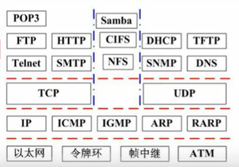

#### 七层结构模型
|层次|名称|功能|设备及协议|
应用层 POP3,FTP,HTT
表示层 P,TELNET,DHCP,DNS,
会话层 SMTP
传输层：端到端的连接,TCP,UDP
网络层：分组传输和路由选择,三层交换机，路由器，IP,ARP
数据链路层：传送以帧未单位的信息,网桥，交换机，网卡，PPP，PPTP
物理层：中继器，集线器

局域网工作在数据链路层和物理层

#### 网络标准与协议
协议族
TCP/IP协议
IPX/SPX协议
NETBEUI协议

DHCP:169.254.xxx，或0.0.0.0,没有与dhcp服务器联系上
DNS:主机向本地域名服务器的查询采用递归查询，本地域名服务器向根域名服务器的查询采用迭代查询
递归查询：服务器必须回答目标IP与域名的映射关系
迭代查询：服务器收到一次迭代查询回复一次结果
#### 网络分类
分布范围：局域、城域、广域、因特网
拓扑结构：总线，星型，环型
#### 网络设计
分层设计：
接入层：向本地网段提供用户接入
汇聚层：网络访问策略控制、数据包处理、过滤、寻址
核心层：数据交换
#### IP地址与子网划分
A类：第一位是0，一个字节的网络地址，三个字节的主机地址 224-2个，全0和全1
B类：10，2个字节的网络地址，两个字节的主机地址
C类：110开头，三个自己网络地址，一个字节主机地址
D类（组播):1110开头
E类：11110
无分类地址：类似于172.18.129.0/24，代表前24位是网络地址
子网掩码用于子网划分，为1的部分对应网络号，0对应主机号；划分子网的过程即以若干个主机位充当子网号
127网段：回拨地址；全0：当前子网的主机；全1：本地子网的广播；主机号全1：特定子网的广播
#### 无线网
接入方式：有接入点模式、无接入点模式
无线局域网：Wifi，无线城域网：wimax，无线广域网：4g，无线个人网：蓝牙
网络接入技术：
有线接入：公用交换电话网络；数字数据网；同轴光纤技术……
无线接入：wifi，蓝牙，红外
3g/4g：WCDMA，CDMA2000,TD-SCDMA……
#### IPV6
地址长度128位，简化报文头部格式，支持身份认真和隐私权，允许更多服务类型

#### 法律法规
著作权法、计算机软件保护条例、商标法、专利法
保护期限、知识产权人确定、侵权判断
知识产权：著作权及邻接权、专利权、工业品外观设计权、商标权、地理标志权、集成电路布图设计权