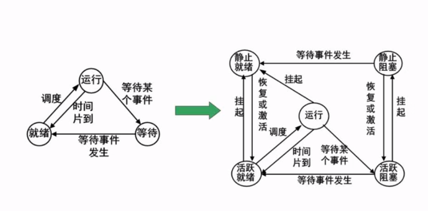

### 进程管理
#### 进程的状态  
这里的时间片到应该是时间片用完的意思  
挂起是人为的  
  

#### 前驱图  
#### pv操作  
s的值为负数时，表示等待的进程数
```
p:
s=s-1
if(s<0){
    放入等待队列
} else {
    继续执行
}
v:
s=s+1
if(s<=0>){
    释放一个等待进程
}
```
#### 死锁问题

### 存储管理
段页式存储
### 文件管理
索引文件
位示图
### 作业管理
### 设备管理
虚设备与spooling技术