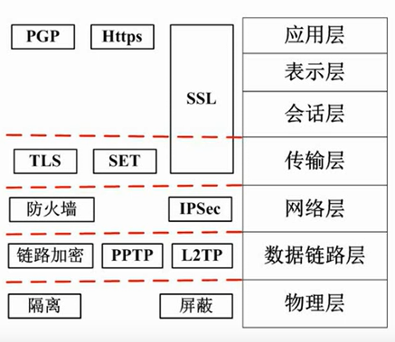

#### 安全属性
- 保密性：最小授权原则、防暴露、信息加密、物理保密
- 完整性：安全协议、校验码、密码校验、数字签名、公证
- 可用性：综合保障（IP过滤、业务控制流、路由选择控制、审计跟踪）
- 不可抵赖性：数字签名
#### 加密技术
- 对称加密技术:DES(替换+移位),3DES,AES,RE-5,IDEA算法
- 非对称加密技术：(加密速度慢,公钥都是公开的，甲发给乙的信息用乙的公钥加密)RSA，Elgamal，ECC,背包算法、Rabin、D-H等
### 信息摘要
单向hash函数、固定长度的散列值，常用算法有md5，sha等。sha160位，md5 128位，因此sha安全性更高。
#### 数字签名
A：产生信息摘要，用A的私钥加密()数字签名->B：用A的公钥解密(数字签名的验证)
#### 数字信封与PGP
- 数字信封：发送方将原文用对称密钥加密传输，而将对称密钥用接收方的公钥加密发送;接收方接到信封哪个，用自己的私钥解封信件，取出对称密钥解密得原文
- PGP：一种协议，承认证书PGP证书和X.509证书
#### 网络安全
- 各个网络层次的安全保障

- 网络威胁与攻击  
重放攻击ARP,拒绝服务DOS,窃听，业务流分析，信息泄露，破坏信息的完整性，非授权访问，假冒，旁路控制，授权侵犯，特洛伊木马，陷阱门，抵赖
- 防火墙
  - 网络级：检查源
    - 包过滤
    - 状态检测
  - 应用级：开箱检查
    - 双穴主机
    - 屏蔽主机
    - 屏蔽子网：在外网和内网之间加上屏蔽子网区(DMZ)，放置对外提供服务的主机，这样攻破了一道防火墙，进入内部还需一道防火墙

#### 数据结构
上三角矩阵对应的一维数组的下标计算公式：(2n-i+1)*i/2+j
下三角矩阵对应的一维数组的下标计算公式：(i+1)xi/2+j
线性结构（顺序表和链表）和非线性结构（树和图）